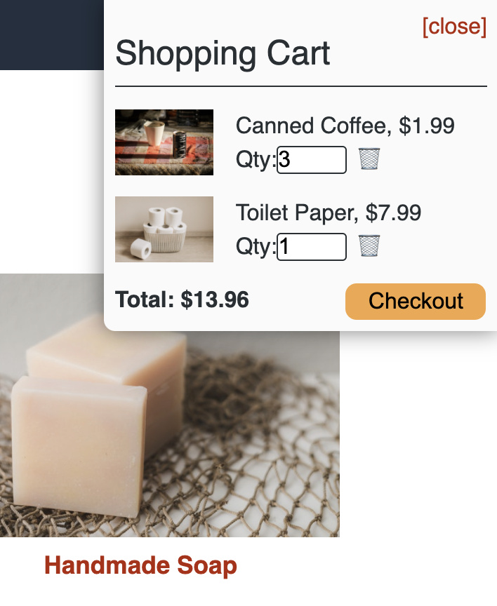
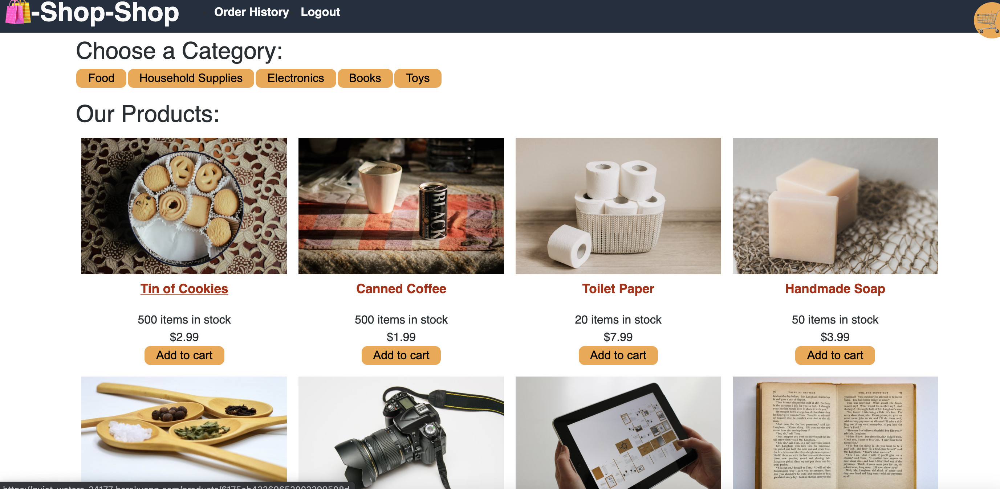
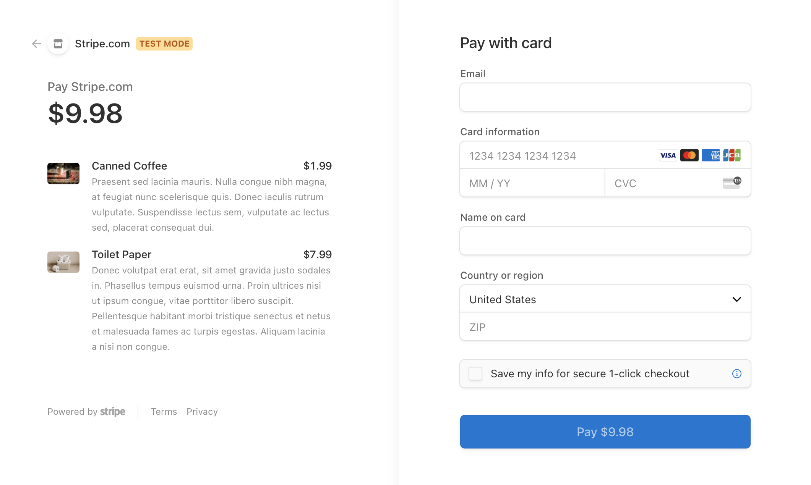

# shop-shop

## Description

This is an e-commerce website that was re-factored to use Redux to monitor Global State. Users can sign up, log-in, add to their cart, check order history, and checkout with stripe. 

## Tools and Languages

    * Javascript
    * CSS
    * HTML
    * MONGODB
    * APOLLO
    * NODE
    * REACT
    * REDUX
    * STRIPE
    * GRAPHQL

## Usage

Anyone can clone the repository and run the application locally. The installation process is conventional to any NodeJS application.

## Deployment

Users can find a deployed application [Here](https://quiet-waters-24177.herokuapp.com/)

This is my Github account [Here](https://github.com/fausnightm/shop-shop)

